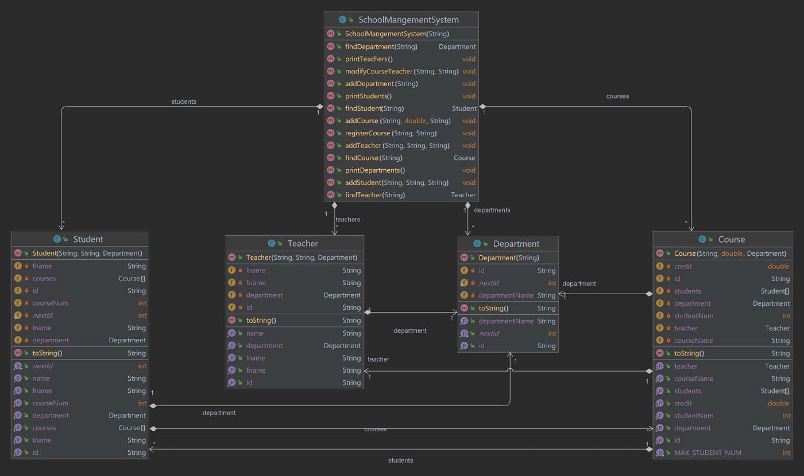

# SchoolManagementSystem 
#### by Eric Toy

Management system for a school. Includes multiple classes involving Student, Teacher, Department and Course. 
Capable of adding/modifying new entities and displaying information on such entities. Other functionalities 
include registration limits for students, prevents registering for the same course, etc.

https://github.com/6251608eric/SchoolManagementSystem.git

## ***Class Diagram***
